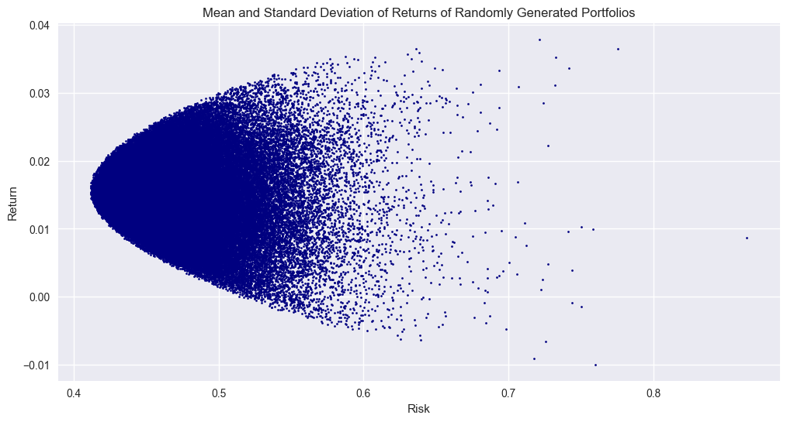

### Mean-Variance Portfolio Optimisation

**Mean-variance optimisation** (MVO) is a cornerstone of modern portfolio theory and investment management, offering a systematic approach to balancing risk and return. It was introduced by economist **Harry Markowitz** in his groundbreaking 1952 paper titled *"Portfolio Selection"*, for which he later won the Nobel Prize in Economics in 1990. This theory revolutionised the way investors think about risk and return, providing a mathematical framework to build portfolios that maximise returns for a given level of risk, or alternatively, minimise risk for a desired level of return.

In this model, the objective is to select a mix of assets that **minimises the overall portfolio variance** for a given level of expected return, or conversely, **maximises the expected return** for a given level of risk.


Harry Markowitz's **mean-variance optimisation** provides a formal method for selecting the optimal portfolio by considering the correlation between assets. Prior to this theory, investment decisions were often based on individual asset returns and risk, without taking into account the relationship between different assets. Markowitz's work integrated the concept of **diversification**, demonstrating how combining assets with low or negative correlation could reduce the overall risk of a portfolio, even if the individual assets themselves were quite volatile.

In this post, we will explore the mathematics behind mean-variance optimisation and demonstrate its practical application using Python. To start, let’s consider a portfolio consisting of two assets, **S1** and **S2**. 

Let the characteristics of these assets be as follows:

- Asset **S1** has an expected return of 5% ($\mathbb{E}[R_1] = 0.05$) and a variance of 0.02 ($\sigma_1^2 = 0.02$).
- Asset **S2** has an expected return of 10% ($\mathbb{E}[R_2] = 0.10$) and a variance of 0.4 ($\sigma_2^2 = 0.4$).

These are the basic **return** and **risk** characteristics when investing solely in one of the two assets. But the core question we want to address is: *What are the return and risk characteristics of a portfolio that invests in both assets simultaneously?*

Assume that the portfolio allocates a proportion $ w_1 $ of its capital to **S1** and a proportion $ w_2 $ to **S2**, where $ w_1 + w_2 = 1 $, and both weights are positive. 

The expected return of this portfolio, denoted as $ \mathbb{E}[R_p] $, is simply the weighted sum of the expected returns of the individual assets. We can see this by applying the linearity of expectation.

$$
\mathbb{E}[R_p] = \mathbb{E}[w_1R_1 + w_2R_2] = w_1 \mathbb{E}[R_1] + w_2 \mathbb{E}[R_2]
$$

This is the foundation of portfolio optimisation: by adjusting the weights $ w_1 $ and $ w_2 $, we can control the expected return of the portfolio.

The next question to answer is: *What is the variance of a portfolio in which we invest a proportion of capital in both assets?* Specifically, we want to find an expression for the variance of the portfolio 

$$ \text{Var}(w_1 R_1 + w_2 R_2) $$

By using the properties of variance for a linear combination of random variables, we can deduce that

$$
\text{Var}(w_1 R_1 + w_2 R_2) = w_1^2 \text{Var}(R_1) + w_2^2 \text{Var}(R_2) + 2w_1 w_2 \text{Cov}(R_1, R_2)
$$

Furthermore, we know that 

$$
\text{Cov}(R_1, R_2) = \rho_{12} \cdot \sigma_1 \cdot \sigma_2
$$

Thus, we can express the portfolio's variance in terms of the correlation between the two assets.

$$
\text{Var}(w_1 R_1 + w_2 R_2) = w_1^2 \text{Var}(R_1) + w_2^2 \text{Var}(R_2) + 2w_1 w_2 \rho_{12} \sigma_1 \sigma_2
$$


Below, we plot the two assets described above across five different correlation values, revealing a crucial insight. As long as the correlation between the two assets is sufficiently low, we can achieve a higher expected return for a given level of risk by diversifying the portfolio between the two assets.

```python
import numpy as np
import matplotlib.pyplot as plt

# Set a nice style/theme for the plot
plt.style.use('seaborn-v0_8')

# Coordinates for the two assets
asset_1 = (0.05, 0.02)  # (expected return, variance)
asset_2 = (0.1, 0.04)   # (expected return, variance)

# Extract the expected returns and variances
r1, var1 = asset_1
r2, var2 = asset_2

# Standard deviations
std1 = np.sqrt(var1)
std2 = np.sqrt(var2)

# Generate portfolio weights (from 0 to 1 for Asset 1)
weights_1 = np.linspace(0, 1, 100)
weights_2 = 1 - weights_1

# Create the plot
plt.figure(figsize=(12, 6))

# Plot the two assets with different colors
plt.scatter(var1, r1, color='blue', label='Asset 1', s=100, zorder=5, edgecolors='black', linewidth=1.5)
plt.scatter(var2, r2, color='blue', label='Asset 2', s=100, zorder=5, edgecolors='black', linewidth=1.5)

# Annotate the points with adjusted positioning
plt.text(var1 + 0.0005, r1 - 0.003, 'Asset 1', fontsize=12, color='black', 
         verticalalignment='top', horizontalalignment='left')
plt.text(var2 + 0.0005, r2 - 0.003, 'Asset 2', fontsize=12, color='black', 
         verticalalignment='top', horizontalalignment='left')

# Plot the portfolios for different correlations
correlations = [1, 0.9, 0.5, 0.1, -0.2]  
colors = ['blue', 'green', 'orange', 'purple', 'brown']  

for i, corr in enumerate(correlations):
    # Covariance calculation for the current correlation
    cov12 = corr * std1 * std2
    
    # Calculate the expected returns and variances for the portfolio
    port_returns = weights_1 * r1 + weights_2 * r2
    port_variances = (weights_1**2 * var1 + weights_2**2 * var2 + 
                      2 * weights_1 * weights_2 * cov12)
    
    # Plot the portfolio line for the current correlation
    plt.plot(port_variances, port_returns, color=colors[i], label=f'Corr = {corr}', linewidth=2)

# Labels and title
plt.xlabel('Variance', fontsize=14)
plt.ylabel('Expected Return', fontsize=14)
plt.title('Mean-Variance optimisation with Different Correlations', fontsize=16)

# Customize grid and legend
plt.grid(True, linestyle='--', alpha=0.7)
plt.legend(fontsize=12, loc='upper left')

# Adjust axis 
plt.xlim(0, 0.05)  
plt.ylim(0, 0.15)  

# Make the axes more prominent
plt.tick_params(axis='both', which='both', direction='in', length=6)

# Show the plot
plt.tight_layout()  
plt.show()
```

<div style="text-align: center;">
  
</div>

The example above, considering only two securities, can be generalised to a universe of $ N $ securities. If we have $ N $ securities and a vector of weights $ \mathbf{w} $ (of length $ N $), where each $ w_i $ satisfies:

$$
0 \leq w_i \leq 1 \quad \text{and} \quad \sum_{i=1}^{N} w_i = 1
$$

(representing the proportion of capital invested in each security), then, by applying the linearity of expectation once again, the expected return of the portfolio is given by:

$$
\mathbb{E}\left[\sum_{i=1}^{N} w_i R_i\right] = \sum_{i=1}^{N} w_i \mathbb{E}[R_i]
$$

Here, $ \mathbb{E}[R_i] $ represents the expected return of the $ i $-th security.

Similarly, the variance of the portfolio is given by:

$$
\text{Var}\left(\sum_{i=1}^{N} w_i R_i\right) = \sum_{i=1}^{N} w_i^2 \text{Var}(R_i) + \sum_{i=1}^{N} \sum_{j \neq i} w_i w_j \text{Cov}(R_i, R_j)
$$

Where:
- $ \text{Var}(R_i) $ is the variance of the $ i $-th security,
- $ \text{Cov}(R_i, R_j) $ is the covariance between the returns of securities $ i $ and $ j $.

Alternatively, we can express the portfolio variance in matrix notation for simplicity. Let $ \mathbf{w} $ be the $ N $-dimensional weight vector, $ \boldsymbol{\mu} $ the vector of expected returns, and $ \Sigma $ the covariance matrix of asset returns. Then:

$$
\mathbb{E}[\text{Portfolio Return}] = \mathbf{w}^T \boldsymbol{\mu}
$$

$$
\text{Var}[\text{Portfolio Return}] = \mathbf{w}^T \Sigma \mathbf{w}
$$

This formulation highlights the role of diversification: by adjusting $ \mathbf{w} $, we can control both the expected return and risk of the portfolio.

Therefore, finding the optimal portfolio can be formulated as an optimisation problem. Specifically, we aim to identify the portfolio weights that minimise the portfolio variance for a given target level of expected return. The optimisation problem can be expressed as follows:

**Objective:**

$$
\min_{\mathbf{w}} \mathbf{w}^T \Sigma \mathbf{w}
$$

**Subject to the constraints:**

1. The portfolio achieves the target expected return:
   $$
   \mathbf{w}^T \boldsymbol{\mu} = \mu_{\text{target}}
   $$

2. The portfolio weights sum to 1 (fully invested portfolio):
   $$
   \sum_{i=1}^{N} w_i = 1
   $$

3. No short-selling (non-negativity constraint):
   $$
   w_i \geq 0 \quad \forall i \in \{1, 2, \dots, N\}
   $$

Here:
- $\mathbf{w}$ is the $N$-dimensional vector of portfolio weights,
- $\Sigma$ is the covariance matrix of asset returns,
- $\boldsymbol{\mu}$ is the vector of expected returns for each asset,
- $\mu_{\text{target}}$ is the desired level of portfolio return.

By solving this optimisation problem, we determine the portfolio weights $\mathbf{w}$ that minimise risk (variance) while satisfying the constraints of achieving the target return and being fully invested. 


To illustrate the concepts of portfolio optimisation, we will consider a case involving six hypothetical securities. First, we generate 2,000 random observations of returns for each security, allowing us to estimate their expected return and variance.

Next, we will simulate 100,000 random portfolio weight vectors (each of length 6 and summing to 1) to represent potential portfolios. For each portfolio, we calculate the expected return and variance of the portfolio

To achieve this, we define and use two key functions: random_weights to generate random weight vectors and random_portfolios to compute the risk and return for each portfolio.

```python
np.random.seed(123)

# Number of assets
assets = 6

# Number of observed returns
return_observations = 2000

## Generating random returns for our 6 securities
return_vec = np.random.randn(assets, return_observations)

def random_weights(n):
    ''' 
    Produces n random weights that sum to 1 
    '''
    allocations = np.random.rand(n)
    weights = allocations / sum(allocations)
    return weights

def random_portfolio(returns):
    ''' 
    Returns the mean and standard deviation of returns for a random portfolio
    '''

    mean_return = np.asmatrix(np.mean(returns, axis=1))
    weights = np.asmatrix(random_weights(returns.shape[0]))
    covariance_matrix = np.asmatrix(np.cov(returns))
    
    mu = weights * mean_return.T
    sigma = np.sqrt(weights * covariance_matrix * weights.T)
    
    return mu, sigma

n_portfolios = 100000

all_portfolios = []
for x in range(n_portfolios):

    all_portfolios.append(random_portfolio(return_vec))

means, stds = np.column_stack(all_portfolios)

plt.figure(figsize=(12, 6))
plt.plot(stds, means, 'o', markersize=2, color='navy')
plt.xlabel('Risk')
plt.ylabel('Return')
plt.title('Mean and Standard Deviation of Returns of Randomly Generated Portfolios')
plt.show()
```
<div style="text-align: center;">
  
</div>

Below, we will use the `cvxopt` package to explicitly solve the mean-variance optimisation problem and calculate the efficient frontier. This optimisation will help us identify the set of portfolios that sit on the upper left boundary of the risk-return plot we generated earlier, representing the portfolios with the lowest risk for a given level of return.

We will begin by first calculating the **minimum variance portfolio (MVP)**. This is analogous to the left-most point in our simulation above. The minimum variance portfolio represents the portfolio with the lowest risk (variance) and is the starting point for the efficient frontier. This is the lowest expected return that a rational investor should target, because any target return lower than this would imply that there is a portfolio with the same risk but a higher expected return. Therefore, any portfolio with a return lower than the MVP would be considered suboptimal. We calculate the minimum variance portfolio using the  `sol_min_var = solvers.qp(S, opt.matrix(0.0, (n, 1)), G, h, A, b)` line in the function below.

The line of code above solves a **quadratic programming (QP)** problem, which is a type of optimisation problem where the objective function is quadratic (i.e., involving squared terms), and the constraints are linear. In the context of portfolio optimisation, we are solving for the portfolio weights $ \mathbf{w} $ that minimise the portfolio's variance, subject to constraints (as defined above).

The inputs used in the `qp` function are as follows:

- ` S `: The covariance matrix of asset returns. 

- `opt.matrix(0.0, (n, 1))` (second argument of `qp`): A zero vector. The objective function in this case has no linear term, so this vector is used to represent the absence of a linear component in the objective function. This means we are minimising the quadratic term only (the portfolio’s variance).

- `G`: The matrix that encodes the inequality constraints, specifically the non-negativity constraint. In this case, `G` is the negative identity matrix $ -I_n $, which ensures that all portfolio weights are greater than or equal to zero:

$$
G \mathbf{w} \geq 0 \quad \text{(i.e., no short-selling)}
$$

- `h`: The vector of values for the inequality constraints. It is a zero vector $ \mathbf{h} = [0, 0, \dots, 0]^T $, enforcing the non-negativity condition on the portfolio weights.

- `A`: is a row vector of ones that ensures the sum of all portfolio weights equals 1:


$$
A = \begin{bmatrix} 1 & 1 & \dots & 1 \end{bmatrix}
$$

-  `b`: The vector that specifies the right-hand side of the equality constraint. In this case, $b = 1$, ensuring that the portfolio weights sum to 1.


After calculating the minimum variance portfolio, we select 100 evenly spaced target returns that lie above the expected return of the minimum variance portfolio. For each of these target returns, we solve for the portfolio with the minimum variance. These portfolios are then connected to form the efficient frontier. To achieve this, we use the same `solvers.qp` function as before, but with the additional constraint that the expected return must match each target return. This constraint is implemented through the extended matrices `A_extended` and `b_extended`, which include the requirement for the portfolio return to equal the specified target return.

```python
import cvxopt as opt
from cvxopt import blas, solvers

solvers.options['show_progress'] = False

def optimal_portfolios(returns):
    """
    Solves the mean-variance optimisation problem using the cvxopt package
    and filters portfolios below the minimum variance portfolio.

    Args:
        returns (numpy.ndarray): A 2D array where rows represent assets and columns represent historical returns.

    Returns:
        tuple: Two lists - the efficient frontier returns and the corresponding risks.
    """
    n = len(returns)  # Number of assets
    returns = np.array(returns)
    
    # Calculate covariance matrix and mean returns
    cov_matrix = np.cov(returns)
    mean_returns = np.mean(returns, axis=1)

    # Convert to cvxopt matrices
    S = opt.matrix(cov_matrix)  # Covariance matrix

    # Create constraint matrices
    G = -opt.matrix(np.eye(n))  # Negative identity matrix (no short-selling constraint)
    h = opt.matrix(0.0, (n, 1))  # Constraint: weights >= 0
    A = opt.matrix(1.0, (1, n))  # Sum of weights equals 1
    b = opt.matrix(1.0)

    # Step 1: Find the minimum variance portfolio
    sol_min_var = solvers.qp(S, opt.matrix(0.0, (n, 1)), G, h, A, b)

    min_var_weights = np.array(sol_min_var['x']).flatten()
    min_var_return = np.dot(mean_returns, min_var_weights)

    # Generate a range of target returns starting from the minimum variance portfolio
    N = 100  # Number of points on the frontier
    target_returns = np.linspace(min_var_return, 0.95*mean_returns.max(), N)

    # Storage for results
    frontier_returns = []
    frontier_risks = []

    # Step 2: Solve the optimisation problem for each target return
    for target_return in target_returns:
        # Additional constraint: portfolio return equals target return
        A_extended = opt.matrix(np.vstack([A, mean_returns]))
        b_extended = opt.matrix([1.0, target_return])

        # Solve the quadratic programming problem
        sol = solvers.qp(S, opt.matrix(0.0, (n, 1)), G, h, A_extended, b_extended)

        if sol['status'] == 'optimal':
            weights = np.array(sol['x']).flatten()  # Extract weights
            portfolio_return = np.dot(mean_returns, weights)
            portfolio_risk = np.sqrt(np.dot(weights.T, np.dot(cov_matrix, weights)))

            frontier_returns.append(portfolio_return)
            frontier_risks.append(portfolio_risk)

    return frontier_returns, frontier_risks, cov_matrix, mean_returns, min_var_weights

returns, risks, cov_matrix, mean_returns, min_var_weights = optimal_portfolios(return_vec)
# Plot the random portfolios
plt.figure(figsize=(12, 6))
plt.plot(stds, means, 'o', markersize=2, color='navy', alpha=0.3, zorder=1)  
plt.xlabel('Risk')
plt.ylabel('Return')
plt.title('Efficient Frontier and the Randomly Generated Portfolios')

# Plot the efficient frontier
plt.plot(risks, returns, '-', markersize=5, color='green', zorder=2)  

# Plot the minimum variance portfolio
min_var_risk = np.sqrt(np.dot(min_var_weights.T, np.dot(cov_matrix, min_var_weights)))  # MVP risk
min_var_return = np.dot(mean_returns, min_var_weights)  # MVP return

plt.scatter(min_var_risk, min_var_return, color='red', edgecolors='black', s=50, label='Minimum Variance Portfolio', zorder=3, linewidths=1)

plt.legend(['Portfolios', 'Efficient Frontier', 'Minimum Variance Portfolio'])
plt.show()
```
<div style="text-align: center;">
  
</div>

Up until this point, we have only considered risky securities within our universe of possible investments and have derived the set of optimal portfolios that invest solely in these risky assets. However, in reality, investors also have the option to invest in a risk-free asset, such as Treasury bills, which offer a guaranteed return. This introduces an additional component to the investment decision-making process.

Now, we will explore the case where the risk-free asset is included in the investment universe. Specifically, we consider an investor who allocates a proportion of their capital to the risk-free asset, while the remaining capital is invested in risky assets. For a rational investor, the proportion of capital allocated to risky assets will be invested in a portfolio that lies on the efficient frontier, which we have already derived. This optimal risky portfolio will provide the highest possible return for a given level of risk.

In this scenario, we think of the investor as holding a combination of two types of assets: the risk-free asset and an optimal risky portfolio that lies on the efficient frontier. The key observation here is that the risk-free asset has no variance and no correlation with the risky assets. As a result, the portfolio consisting of both the risk-free asset and the optimal risky portfolio can be represented as a straight line.

Consider the example below. In the first scenario, the investor selects the minimum variance portfolio as their risky portfolio. The set of portfolios formed by combining this risky portfolio with the risk-free asset is represented by the dashed red line. Now, let’s consider an investor who chooses to invest in a combination of the risk-free asset and an alternative risky portfolio, represented by the purple dot. This combination is shown by the dotted purple line.

Notice that the dotted purple line lies above the dashed red line for all possible portfolio selections. This implies that, for any given target return, a portfolio from Portfolio Set 2 (the dotted purple line) will always have a smaller variance than a portfolio from Portfolio Set 1 (the dashed red line). While both of these risky portfolios are located on the efficient frontier, their efficiency is not the same when combined with the risk-free asset.

In fact, we can observe that there are other possible risky portfolios that could generate a new line that even sits above the dotted purple line. As the slope of this line increases, the set of portfolios becomes more efficient, provided the line still intersects the efficient frontier. The most efficient choice of risky portfolio corresponds to the line that is tangent to the efficient frontier, and this portfolio is referred to as the Optimal Risky Portfolio. The line formed by combining the risk-free asset and the **Optimal Risky Portfolio** is called the **Capital Allocation Line (CAL)**.

```python
plt.figure(figsize=(12, 6))
plt.plot(stds, means, 'o', markersize=2, color='navy', alpha=0.3, zorder=1)  
plt.xlabel('Risk')
plt.ylabel('Return')
plt.title('Constructing Portfolios with the Risk Free Asset')
plt.plot(risks, returns, '-', markersize=5, color='green', zorder=2)  
min_var_risk = np.sqrt(np.dot(min_var_weights.T, np.dot(cov_matrix, min_var_weights)))  # MVP risk
min_var_return = np.dot(mean_returns, min_var_weights)  # MVP return

plt.scatter(min_var_risk, min_var_return, color='red', edgecolors='black', s=50, label='Minimum Variance Portfolio', zorder=3, linewidths=1)

# Add dashed red line starting from y=0.003 and intercepting the MVP
risk_free_rate = 0.003

# Use interpolation to find the risk for the target return (0.003)
from scipy.interpolate import interp1d

# Interpolate over the efficient frontier
efficient_frontier = interp1d(returns, risks, kind='linear', fill_value="extrapolate")

# Find the risk corresponding to the return of 0.003
target_risk_1 = efficient_frontier(risk_free_rate)

# Plot the dashed red line
plt.plot([0, min_var_risk], [risk_free_rate, min_var_return], 'r--', label='Portfolio Set 1', zorder=4)

# Add dotted red line starting from y=0.003 and intersecting the efficient frontier at a higher value
risk_free_rate = 0.003
target_risk_2 = efficient_frontier(risk_free_rate + 0.02)  # Choose a higher return to intersect the frontier

# Plot the dotted  line
plt.plot([0, target_risk_2], [risk_free_rate, risk_free_rate + 0.02], color='purple', linestyle=':', label='Portfolio Set 2', zorder=4)
plt.scatter(target_risk_2, risk_free_rate + 0.02, color='Purple', edgecolors='black', s=50, label='Other Risky Portfolio', zorder=5, linewidths=1)

plt.legend(['Portfolios', 'Efficient Frontier', 'Minimum Variance Portfolio',  'Portfolio Set 1', 'Portfolio Set 2','Other Risky Portfolio',])
plt.show()
```
<div style="text-align: center;">
  
</div>

The Capital Allocation Line (CAL) represents the set of portfolios that combine a risk-free asset with a risky portfolio. The slope of the CAL is crucial in portfolio theory, as it determines the trade-off between risk and return. It is equal to the **Sharpe Ratio** of the risky portfolio, which measures the risk-adjusted return of the portfolio.

The function for the Capital Allocation Line is given by: 

$$r_{\text{portfolio}} = r_f + \left( \frac{r_p - r_f}{\sigma_p} \right) \sigma_{\text{portfolio}}$$

```python
from scipy import optimise

def find_optimal_sharpe_ratio(asset_returns, risk_free_rate):
    """
    Find the optimal portfolio by maximising the Sharpe ratio.
    """
    
    def calculate_sharpe(weights):
        
        avg_returns = [np.mean(asset) for asset in asset_returns]
        
        numerator = sum(weights[i] * avg_returns[i] for i in range(len(avg_returns))) - risk_free_rate
        
        covariance_matrix = np.corrcoef(asset_returns)
        denominator = np.sqrt(weights.T.dot(covariance_matrix.dot(weights)))
        
        return numerator / denominator
    
    initial_guess = np.ones(len(asset_returns)) / len(asset_returns)
    
    def objective_function(weights):
        return -calculate_sharpe(weights)
    
    # Set up equality constraint for the sum of weights to be 1
    constraints = {'type': 'eq', 'fun': lambda weights: np.sum(np.abs(weights)) - 1} 

    # Set bounds for individual asset weights
    bounds = [(0, 1)] * len(asset_returns)
    
    # Solve the optimisation problem
    optimisation_result = optimise.minimise(objective_function, initial_guess,
                                            constraints=constraints, bounds=bounds, 
                                            method='SLSQP', options={'disp': False})
    
    return optimisation_result

# Assuming an annual risk-free rate of 3%
annual_risk_free_rate = (1 + 0.03) ** (1 / 252) - 1

# Find the optimal portfolio
optimal_result = find_optimal_sharpe_ratio(return_vec, annual_risk_free_rate)

# Calculate the optimal portfolio's expected return and standard deviation
optimal_expected_return = sum(optimal_result.x[i] * np.mean(return_vec[i]) for i in range(len(optimal_result.x)))

covariance_matrix = np.corrcoef(return_vec)
optimal_risk = np.sqrt(optimal_result.x.T.dot(covariance_matrix.dot(optimal_result.x)))

plt.figure(figsize=(12, 6))
plt.plot(stds, means, 'o', markersize=2, color='navy', alpha=0.3, zorder=1)
plt.xlabel('Risk')
plt.ylabel('Return')
plt.title('Capital Allocation Line and the Optimal Portfolio')

# Plot the Capital Allocation Line (CAL) from the risk-free rate to the optimal portfolio
capital_allocation_line = lambda risk : ( (optimal_expected_return - annual_risk_free_rate) / optimal_risk ) * risk + annual_risk_free_rate    

risk_range = np.linspace(0., 1., num=11)

plt.plot(risk_range, [capital_allocation_line(risk) for risk in risk_range], color='darkorange', linestyle='--', linewidth=2, zorder=2)

# Plot the optimal portfolio
plt.scatter(optimal_risk, optimal_expected_return, color='orange', edgecolors='black', s=50, label='Optimal Portfolio', zorder=3, linewidths=1)

plt.legend(['Portfolios', 'Capital Allocation Line', 'Optimal Portfolio'])
plt.show()
```
<div style="text-align: center;">
  
</div>


In this analysis, we have used mean-variance optimisation to derive the Capital Allocation Line (CAL) and the Optimal Portfolio for an investor considering a combination of risky assets and a risk-free asset. By maximizing the Sharpe Ratio, we identified the most efficient portfolio that balances risk and return. The Capital Allocation Line, which connects the risk-free asset with the optimal portfolio, visually demonstrates the set of all efficient portfolios that can be achieved by varying the allocation between risky assets and the risk-free asset. The optimal portfolio lies at the point where this line is tangent to the efficient frontier, representing the highest possible return per unit of risk. The concept of mean-variance optimisation is a cornerstone of modern portfolio theory and remains a widely used framework in finance for asset allocation and portfolio management. 

While mean-variance optimisation is foundational, it is important to recognize its limitations, such as the assumption of normally distributed returns and the reliance on historical data for estimating future returns and risks. Nonetheless, it remains a powerful tool for understanding the dynamics of portfolio construction and is a critical part of the toolkit for both professional and individual investors seeking to make informed investment decisions.